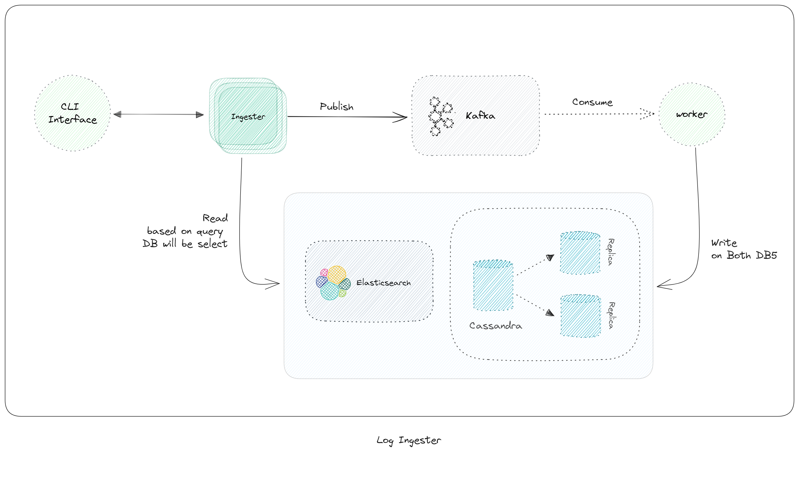

Certainly! Below is an updated README that includes details about Kafka integration and data insertion into both Cassandra and Elasticsearch.

---

# Log Ingestor and Query Interface

## Overview

This project implements a log ingestor system and a query interface to efficiently handle vast volumes of log data. The log ingestor is designed to handle log ingestion over HTTP, and the query interface provides a user-friendly way to search and filter logs using various criteria.

## Table of Contents

- [Technologies](#technologies)
- [System Architecture](#system-architecture)
- [Log Ingestor](#log-ingestor)
- [Query Interface](#query-interface)
- [Kafka Integration](#kafka-integration)
- [Data Insertion](#data-insertion)
- [Advanced Features](#advanced-features)
- [How to Run](#how-to-run)

## Technologies

The following technologies were chosen for this project:

- **Programming Language:** TypeScript
- **Log Storage:** Cassandra
- **Full-text Search:** Elasticsearch
- **Message Broker:** Kafka
- **HTTP Server:** Express
- **Containerization:** Docker

## System Architecture

The system is designed to leverage the strengths of different technologies for specific tasks. Cassandra is used for efficient log querying and filtering, Elasticsearch for full-text search, Kafka for message queuing, and Docker for containerization.



## Log Ingestor

The log ingestor exposes an HTTP server on port 3000 for log ingestion. Logs are received in JSON format and stored in Cassandra for efficient querying.

Key Features:

- **Scalability:** Handles high volumes of logs efficiently.
- **Bottleneck Mitigation:** Mitigates potential bottlenecks using asynchronous processing and efficient database interactions.
- **HTTP Ingestion:** Logs are ingested via an HTTP server on port 3000.

## Query Interface

The query interface provides a user-friendly way to search and filter logs using a combination of full-text search and specific field filters. It uses both Elasticsearch and Cassandra to leverage their respective strengths.

Key Features:

- **User Interface:** Web UI for easy log searching.
- **Full-text Search:** Utilizes Elasticsearch for efficient full-text search.
- **Filters:** Supports filters based on various log fields.
- **Scalability:** Adapts to increasing volumes of logs/queries.

## Kafka Integration

The system integrates Kafka for real-time log ingestion. Logs are pushed to Kafka topics and consumed by the log ingestor for near real-time processing.

Key Features:

- **Message Queuing:** Kafka serves as a reliable message broker for log messages.
- **Real-time Processing:** Enables near real-time log ingestion and processing.

## Data Insertion

Log data is inserted into both Cassandra and Elasticsearch for efficient querying and full-text search, respectively.

Key Features:

- **Cassandra:** Used for efficient querying and filtering of log data.
- **Elasticsearch:** Used for full-text search capabilities.

## How to Run
To get started with the Log Ingestor and Query Interface, follow the steps below:

### 1. Clone the Repository

```bash
git clone <repository-url>
cd <repository-directory>
```

### 2. Build Docker Images

```bash
docker-compose build
```

### 3. Run the Docker Compose

```bash
docker-compose up
```

This command will start the Ingester, Worker, Nginx, Cassandra, and other services.

### 4. Setting Up Cassandra Tables (First time)

For some reason, the setup file for Cassandra tables is not automatically executed during container startup. To seamlessly set up Cassandra tables:

1. **Identify Cassandra Container ID:**

   ```bash
   docker ps
   ```

   Identify the container ID for the Cassandra instance.

2. **Run Setup Script:**

   ```bash
   docker cp ./setup-cassandra.cql <container-id>:/
   docker exec <container-id> bin/sh -c "cqlsh --file setup-cassandra.cql;"
   ```

   Replace `<container-id>` with the actual container ID obtained in step 1.

### 5. Access the Query Interface

Visit [http://localhost:3000](http://localhost:3000) to access the Query Interface.

check out the [API docs](/api-docs.md) for interactions.
